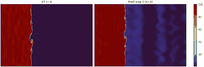
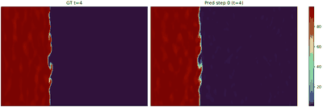
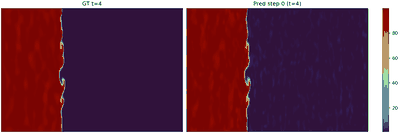

# Modeling Turbulent Radiative Layer Dynamics Using Neural Operators

## О проекте

Исследование посвящено прогнозированию динамики `turbulent_radiative_layer_2D` с помощью нейросетевых моделей для физических полей. Основная задача проекта - по нескольким предыдущим временным шагам предсказывать будущую эволюцию системы и уменьшать деградацию качества при авторегрессионном rollout.

В текущей версии проекта рассматриваются 4 поля:

- `density`
- `pressure`
- `velocity_x`
- `velocity_y`

На текущем этапе основная исследовательская линия - семейство `FNO`-моделей. Следующий шаг - сравнение с `U-Net`, который запланирован как следующая архитектурная ветка после завершения анализа результатов по чекпоинту 5.

## Статус

- Текущий этап: чекпоинт 5
- Уже сделано: репозиторий и план работ, обзор литературы, подготовка датасета и EDA, baseline и метрики, серия улучшенных `FNO`-экспериментов
- Текущее лучшее решение: `Delta_32_4`
- Следующий этап: обучение и сравнение `U-Net` с текущими `FNO`-моделями

## Участники

- Студент: Эмиль Фахретдинов
- Научный руководитель: Каюмов Руслан Асхатович

## Данные и постановка задачи

- Датасет: `turbulent_radiative_layer_2D`
- Источник: [The Well](https://polymathic-ai.org/the_well/datasets/turbulent_radiative_layer_2D/)
- Вход модели: 4 предыдущих шага
- Текущая оценка качества: `1-step` прогноз и `4-step autoregressive rollout`
- Нормализация: `Z-score`

Связанные материалы:

- `dataset.ipynb` - загрузка данных, структура полей, подготовка выборок
- `data_explore.ipynb` - EDA и визуальный анализ траекторий
- `models_eval.ipynb` - сравнение baseline и улучшенных моделей

## Прогресс по чекпоинтам

### Чекпоинт 1

Сформирован репозиторий проекта и верхнеуровневый план работы. В `README.md` зафиксированы тема, участники, структура этапов и логика движения от данных и baseline к улучшенным архитектурам.

### Чекпоинт 2

Проведен обзор направлений, релевантных задаче прогнозирования физических полей:

- neural operators и `FNO`
- сверточные архитектуры уровня `U-Net`
- авторегрессионное предсказание для PDE и физически мотивированных симуляций
- метрики сравнения `baseline`, `SOTA` и устойчивости rollout

Итог этого этапа использован для выбора семейства моделей на чекпоинте 5: сначала серия `FNO`, далее - сравнение с `U-Net`.

### Чекпоинт 3

Выполнены подготовка данных и EDA:

- изучена структура датасета и состав полей
- собраны выборки для обучения и валидации
- проведен анализ пространственно-временной динамики
- проверено поведение полей при rollout

- `dataset.ipynb`
- `data_explore.ipynb`

### Чекпоинт 4

Собран baseline и зафиксированы метрики для дальнейшего сравнения:

- baseline для сравнения: `Authors (FNO)`
- метрики: `VRMSE`, `Rel L2`, `R2`, `RMSE`, `MAE`
- подготовлен сценарий сравнения baseline с улучшенными моделями

- `models_eval.ipynb`
- `results/`

### Чекпоинт 5

На текущем этапе выполнено улучшение решения через серию экспериментов с `FNO`:

- протестированы `delta`- и `full-frame`-варианты предсказания
- сравнены несколько конфигураций по числу мод и слоев
- зафиксированы результаты как для `1-step`, так и для `4-step rollout`
- проведено сравнение не только с baseline, но и с внешним ориентиром `Authors (FNO)`

На данный момент в репозитории отражены результаты по `FNO`. Следующий архитектурный шаг - `U-Net`.

## Итоги чекпоинта 5

Среди текущих экспериментов лучший результат показывает `Delta_32_4`:

- `1-step VRMSE`: `0.2816` против `0.5121` у `Authors (FNO)`
- `4-step rollout VRMSE`: `0.3411` против `1.6885` у `Authors (FNO)`

Это дает примерно:

- `45%` улучшения по `1-step VRMSE`
- `80%` улучшения по `4-step rollout VRMSE`

Среди `full-frame` моделей лучший результат на текущий момент показывает `Full_64_4`, но он все еще уступает лучшему `delta`-варианту. Это делает ветку `delta` наиболее сильной отправной точкой перед переходом к `U-Net`.

## Сравнение моделей

### 1-step prediction

Источник: `results/Model Comparison (1-Step Prediction).csv`

| Model | VRMSE ↓ | Rel L2 ↓ | R2 ↑ | RMSE ↓ |
| --- | ---: | ---: | ---: | ---: |
| Authors (FNO) | 0.5121 | 0.5114 | 0.7207 | 0.5227 |
| Delta_16_4 | 0.2896 | 0.2892 | 0.9096 | 0.2957 |
| Delta_32_4 | **0.2816** | **0.2812** | **0.9137** | **0.2876** |
| Full_16_4 | 0.3090 | 0.3086 | 0.8969 | 0.3155 |
| Full_32_4 | 0.2997 | 0.2993 | 0.9019 | 0.3061 |
| Full_32_5 | 0.3079 | 0.3075 | 0.8964 | 0.3145 |
| Full_64_4 | 0.2973 | 0.2969 | 0.9031 | 0.3037 |

### 4-step autoregressive rollout

Источник: `results/Model Comparison (Rollout 4-step).csv`

| Model | VRMSE ↓ | Rel L2 ↓ | R2 ↑ | RMSE ↓ | MAE ↓ |
| --- | ---: | ---: | ---: | ---: | ---: |
| Authors (FNO) | 1.6885 | 1.6864 | -2.1406 | 1.7192 | 0.5966 |
| Delta_16_4 | 0.3483 | 0.3478 | 0.8696 | 0.3552 | 0.1376 |
| Delta_32_4 | **0.3411** | **0.3406** | **0.8741** | **0.3479** | **0.1307** |
| Full_16_4 | 0.3624 | 0.3618 | 0.8588 | 0.3695 | 0.1520 |
| Full_32_4 | 0.3550 | 0.3544 | 0.8638 | 0.3620 | 0.1390 |
| Full_32_5 | 0.3594 | 0.3588 | 0.8604 | 0.3665 | 0.1436 |
| Full_64_4 | 0.3522 | 0.3517 | 0.8658 | 0.3592 | 0.1341 |

### Покомпонентное сравнение: 1-step VRMSE

Источник: `results/Per-field Comparison (1-Step).csv`

| Model | density | pressure | velocity_x | velocity_y |
| --- | ---: | ---: | ---: | ---: |
| Authors (VRMSE) | 0.3346 | 0.6925 | 0.4643 | 0.5568 |
| Delta_16_4 | 0.1551 | 0.3681 | 0.3028 | 0.3323 |
| Delta_32_4 | **0.1423** | **0.3624** | **0.2954** | **0.3262** |
| Full_16_4 | 0.1661 | 0.3979 | 0.3207 | 0.3513 |
| Full_32_4 | 0.1502 | 0.3939 | 0.3110 | 0.3436 |
| Full_32_5 | 0.1547 | 0.4044 | 0.3181 | 0.3545 |
| Full_64_4 | 0.1459 | 0.3908 | 0.3085 | 0.3438 |

### Покомпонентное сравнение: 4-step rollout VRMSE

Источник: `results/Per-field Comparison (Rollout).csv`

| Model | density | pressure | velocity_x | velocity_y |
| --- | ---: | ---: | ---: | ---: |
| Authors (VRMSE) | 1.9597 | 1.4643 | 0.9464 | 2.3837 |
| Delta_16_4 | 0.1929 | 0.4444 | 0.3532 | 0.4027 |
| Delta_32_4 | **0.1818** | **0.4391** | **0.3478** | **0.3958** |
| Full_16_4 | 0.2014 | 0.4659 | 0.3657 | 0.4165 |
| Full_32_4 | 0.1929 | 0.4615 | 0.3562 | 0.4093 |
| Full_32_5 | 0.1942 | 0.4653 | 0.3616 | 0.4164 |
| Full_64_4 | 0.1903 | 0.4588 | 0.3522 | 0.4076 |

### Рост ошибки по горизонту rollout

Источник: `results/Error Growth (Rollout Stability).csv`

| Model | Step 1 | Step 2 | Step 3 | Step 4 |
| --- | ---: | ---: | ---: | ---: |
| Authors | 0.5098 | 0.7238 | 1.1606 | 2.9894 |
| Delta_16_4 | 0.2870 | 0.3337 | 0.3670 | 0.3947 |
| Delta_32_4 | **0.2787** | **0.3260** | **0.3598** | **0.3885** |
| Full_16_4 | 0.3065 | 0.3475 | 0.3793 | 0.4070 |
| Full_32_4 | 0.2968 | 0.3398 | 0.3727 | 0.4005 |
| Full_32_5 | 0.3048 | 0.3454 | 0.3762 | 0.4022 |
| Full_64_4 | 0.2942 | 0.3378 | 0.3692 | 0.3976 |

## Визуальное сравнение rollout

Ниже приведены GIF-анимации rollout по полю `density` для одной и той же траектории:

| Authors (FNO) | Best delta model: Delta_32_4 | Best full-frame model: Full_64_4 |
| --- | --- | --- |
|  |  |  |

Дополнительно сохранены GIF для остальных конфигураций:

- `plot_gifs_out/plots_delta_gifs/delta_16_4/traj000_density_delta_best_by_valid_rollout_vrmse_delta/sequence.gif`
- `plot_gifs_out/plots_full_gifs/full_16_4/traj000_density_full_best_by_valid_rollout_vrmse/sequence.gif`
- `plot_gifs_out/plots_full_gifs/full_32_4/traj000_density_full_final_model_full_frame/sequence.gif`
- `plot_gifs_out/plots_full_gifs/full_32_5/traj000_density_full_final_model_full_frame/sequence.gif`

## Основной вывод

Текущие эксперименты показывают, что уже на этапе чекпоинта 5 удалось существенно улучшить baseline и внешний ориентир `Authors (FNO)` по всем ключевым метрикам. Наиболее сильной конфигурацией стала `Delta_32_4`, которая одновременно:

- показывает лучший `1-step` результат
- дает лучший `4-step rollout`
- медленнее остальных накапливает ошибку по горизонту

Таким образом, текущая версия проекта уже содержит улучшенное решение и его сравнение с baseline. Следующий исследовательский шаг - проверить, сможет ли `U-Net` превзойти текущий лучший `FNO`-вариант на тех же метриках и GIF-сценариях сравнения.

## Структура репозитория

- `dataset.ipynb` - работа с датасетом и подготовка выборок
- `data_explore.ipynb` - EDA и первичная визуализация
- `models_eval.ipynb` - сравнение baseline и улучшенных моделей
- `training_scripts/train_fno_delta.py` - обучение `delta`-вариантов `FNO`
- `training_scripts/train_fno_full_frame.py` - обучение `full-frame`-вариантов `FNO`
- `autoregressive_pretrained_fno.py` - rollout и визуализация предобученной авторской модели
- `results/` - итоговые таблицы по метрикам
- `plot_gifs_out/` - GIF-анимации rollout
- `models_trained/` - сохраненные чекпоинты моделей
